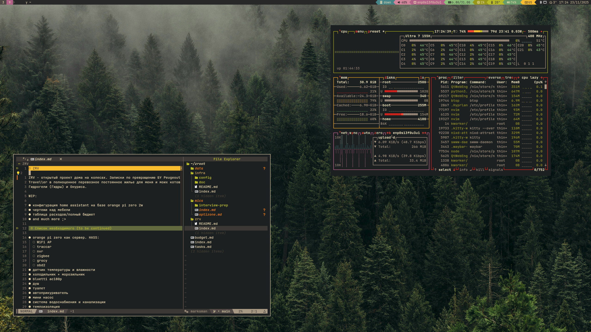
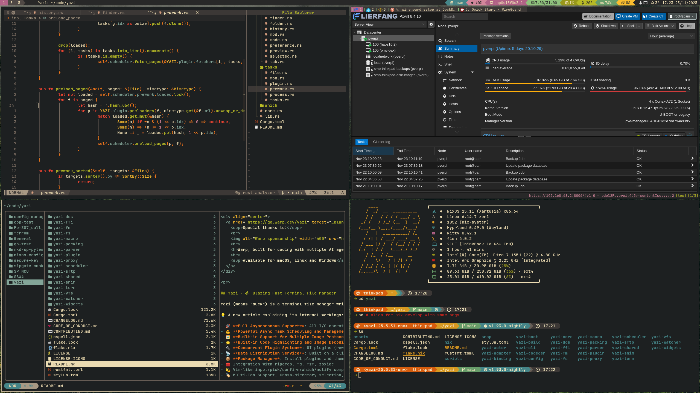

# NixOS Flake gruv-rice-box

My personal Gruvbox themed rice of NixOS based on Hyprland. It also contains all
necessary integrations with zroot-infra and NixOS Flake configs of some of its
services.



## About

Workflow based around these programs:

- Hyprland (Wayland)
- fish
- kitty
- nvim
- qutebrowser
- yazi

### Quick start

`flake.nix` contains all of the avaliable systems. You can add your own (and
delete mine) or you can use `generic-pc` or `generic-laptop`.

```Bash
# It is recommended to start at $HOME directory, because some components (only nh
# CLI at this moment) assume that $HOME/nixos is your system flake.
cd ~

# Obtain the source code
git clone https://github.com/optizone/nixos.git && cd nixos

# Obtain wallpapers (optional: more on this at Installing wallpapers section)
git clone git@github.com:optizone/wallpapers.git ~/Pictures/wallpapers

# Set git credentials with your own
sed -i 's/gitUsername = "optizone"/gitUsername = "git-username"/' flake.nix
sed -i 's/gitEmail = "ilya.kek.lol.orbidol@gmail.com"/gitEmail = "email@email.com"/' flake.nix

# Set host and username (substitute `generic-pc -> generic-laptop` and 
# `pc-user -> laptop-user` in case of using `generic-laptop` system)
sed -i 's/host = "generic-pc"/host = "host"/' flake.nix
sed -i 's/username = "pc-user"/username = "username"/' flake.nix

# Copy your hardware config
# Assuming you are using clean NixOS install. In case not check paths.
cp /etc/nixos/hardware-configuration.nix ./hosts/generic/hardware-configuration.nix

# Apply to boot configuration your choosen system (generic-pc in this case)
# Assumes enabled experimental features. If not, add these argumets:
# `--extra-experimental-features nix-command --extra-experimental-features flakes`
nixos-rebuild boot --use-remote-sudo --flake ./#generic-pc

# Assign password for the user
sudo passwd username

# Pray 😈
reboot

# From now on you can use nh command to manage your system
nh --help
```

### Installing wallpapers

At this point wallpapers are expected to be located at `~/Pictures/wallpapers`.
This repository does not contain wallpapers because I'm not sure at the moment
how to best approach storing and linking them to the config. So you have 2
options: manually install your wallpappers into `~Pictures/wallpappers` or run
`git clone git@github.com:optizone/wallpapers.git ~/Pictures/wallpapers` to
download mine.

### Fine grained configuration

Each module contains `default.nix` file that is used in `generic-*` systems. If
you want to select what software to install (for example you only need `firefox`
browser and don't want to install `google-chrome`) you can replace `../../home/`
line in `user.nix` with the list of modules you want to enable (for example
`../../home/browsers/firefox.nix` to install `firefox`). See
[home/default.nix](./home/default.nix) for default configuration.

### Gallery


#

## Special thanks

To @Frost-Phoenix's rice of NixOS for inspiration.
