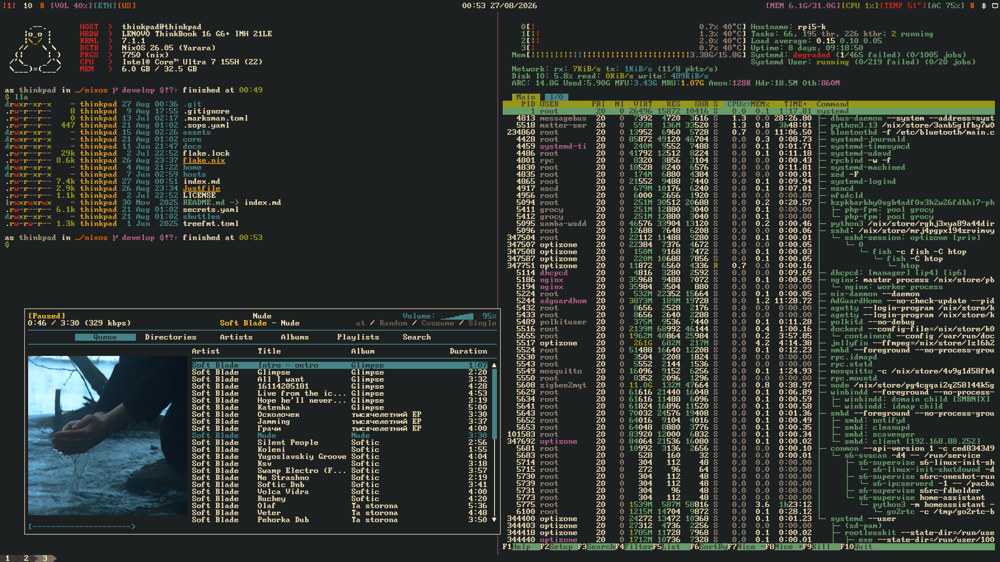
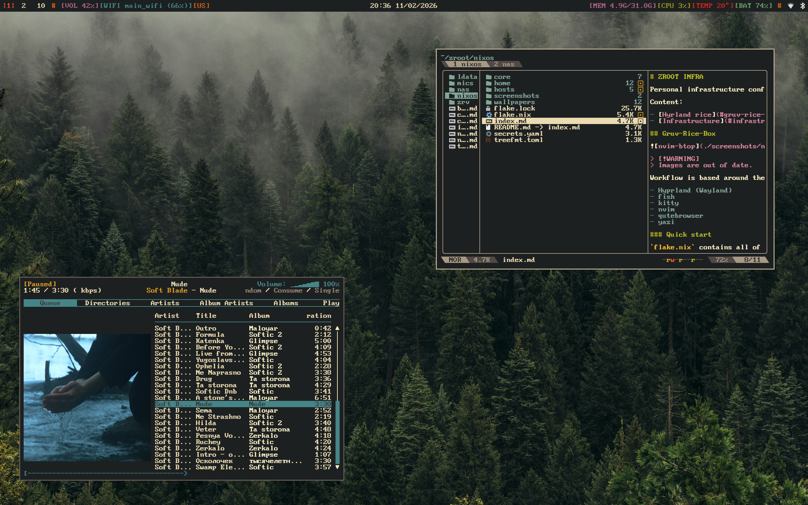
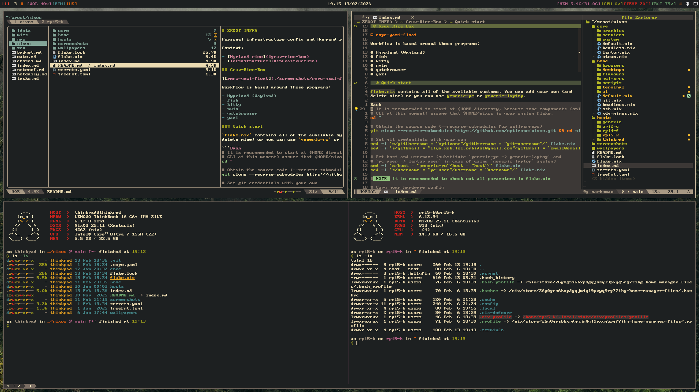
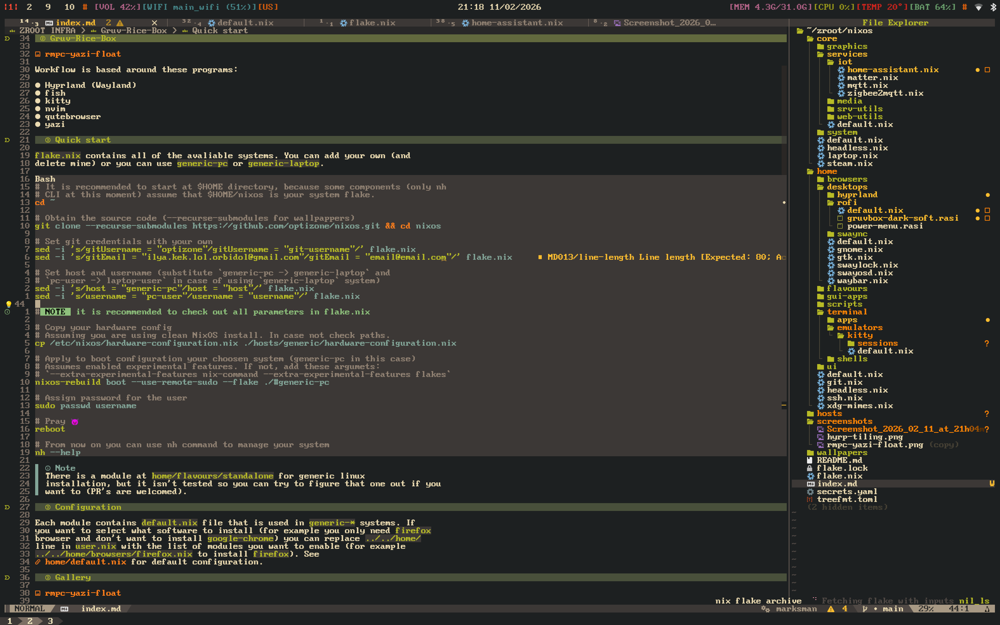

# zroot/nixos

<!--toc:start-->

- [zroot/nixos](#zrootnixos)
  - [Gruv-Rice-Box](#gruv-rice-box)
    - [Quick start](#quick-start)
    - [Configuration](#configuration)
    - [Services](#services)
    - [Gallery](#gallery)
  - [Infrastructure](#infrastructure)
    - [Quick start](#quick-start-1)
    - [Devices](#devices)
  - [Special thanks](#special-thanks)

<!--toc:end-->

Personal infrastructure config and Hyrpand rice.

Idea is to have one directory (`/zroot`) to be a _consentually_ self replicating
Zettelkästen, infrastructure code and data.

```bash
zroot
├── ldata
│   ├── backups
│   ├── builds
│   ├── code
│   ├── disk-images
│   ├── persist # for impermanence
│   ├── media # jellyfin and immich expect these dirs to exist
│   │   ├── movies
│   │   ├── music
│   │   ├── gallery
│   │   └── tv
│   ├── secrets
│   └── wiki # kiwix-images zeal maps and other knowledge sources
├── nas
│   ├── rpi4-f # each is a mounted `/zroot` (dir = NAS hostname)
│   └── rpi5-k
├── nixos # this repo
├── notes # your second brain
└── shuttles # mounted drives
    └── apollo11 # can be used as live-iso
        ├── zroot
        ├── boot
        └── nix
```

That leaves only two (`/boot` and `/nix`) to worry about. With
[impermanence](https://github.com/nix-community/impermanence) we can persist
only these three directories.

Using `rsync` we can set rules of what data should be backed up where. For
instance:

```bash
rsync /zroot/notes/              /zroot/nas/rpi4-f/notes
rsync /zroot/ldata/media/movies/ /zroot/nas/rpi5-k/ldata/media/movies
rsync /zroot                     /zroot/shuttles/k1/zroot
```

Assuming `rsync` runs every day, you can be sure, that `/zroot` is up to date on
all machines you have. This way it is trivial to add, replace or recover
servers.

## Gruv-Rice-Box

Gruvbox colored retro config. No animations, no opacity, no applets, only
terminal (and an occasional gui).



Workflow is based around these programs:

- Hyprland (Wayland)
- fish
- kitty
- nvim
- qutebrowser
- yazi

### Quick start

> [!WARNING]
> This repo is under heavy construction. `generic-*` targets are not tested,
> expect possible breakages, and refer to `thinkpad` or `rpi*` systems for
> working config in case something isn't working.

`flake.nix` contains all of the avaliable systems. You can add your own (and
delete mine) or you can use `generic-pc` or `generic-laptop`.

```Bash
# It is recommended to start at $HOME directory, because some components (only nh
# CLI at this moment) assume that $HOME/nixos is your system flake.
cd ~

# Obtain the source code (--recurse-submodules for wallpappers)
git clone --recurse-submodules https://github.com/optizone/nixos.git && cd nixos

# Set git credentials with your own
sed -i 's/gitUsername = "generic"/gitUsername = "<your-git-useranme-here>"/' flake.nix
sed -i 's/gitEmail = "generic@generic.gen"/gitEmail = "<your-git-email-here>"/' flake.nix

# Set host and username 
sed -i 's/host = "generic-host"/host = "<your-host-here>"/' flake.nix
sed -i 's/username = "generic-user"/username = "<your-username-here>"/' flake.nix

# NOTE: it is recommended to check out all parameters in flake.nix

# Copy your hardware config
# Assuming you are using clean NixOS install. In case not set paths.
cp /etc/nixos/hardware-configuration.nix ./hosts/generic/hardware-configuration.nix

# Apply to boot configuration your choosen system (generic-pc in this case)
# Assumes enabled experimental features. If not, add these argumets:
# `--extra-experimental-features nix-command --extra-experimental-features flakes`
nixos-rebuild boot --use-remote-sudo --flake ./#generic-pc

# Assign password for the user
sudo passwd username

# Pray 😈
reboot

# From now on you can use nh command to manage your system
nh --help
```

For default keybinds check out
[./home/desktops/hyprland/config.nix](./home/desktops/hyprland/config.nix)

dmenu: WIN+SHIFT+D;\
kitty: WIN+ENTER;\
keybinds: WIN+F1;

> [!NOTE]
> There is a module at `home/flavours/standalone` for generic linux
> installation, but it isn't tested so you can try to figure that one out if you
> want to (PR's are welcomed).

### Configuration

Each module contains `default.nix` file that is used in `generic-*` systems. If
you want to select what software to install (for example you only need `firefox`
browser and don't want to install `google-chrome`) you can replace `../../home/`
line in `user.nix` with the list of modules you want to enable (for example
`../../home/browsers/firefox.nix` to install `firefox`). See
[home/default.nix](./home/default.nix) for default configuration.

### Services

In this repo you can find configs for some bundles of services connected in one
homelab that can span multiple servers (including user laptops and PCs).

Monitoring:

- `smartd + node_exporter -> prometheus -> grafana`
- `wakatime-cli -> wakapi`
- `sysbench + stress-ng`
- `htop + iotop + iperf` and a bunch of other system monitoring tools
- `wireshark`

NAS/Media: `samba + jellyfin + immich (wip)`

IoT: `home-assistant + zigbee2mqtt + matter-server + mosquitto`

Virtualization: `incus + podman + docker`

Personal finance: `actual`

Car service bookkeeping: `lubelogger`

AI: `ollama + opencode`

Meshtastic: `mnodes + contact` (configs and TUI)

GUI/CLI/TUI programs can be found in [home/](./home/default.nix).

### Gallery







## Infrastructure

> [!WARNING]
> This section (as also this very git repo) is under heavy development. Use
> wisely, don't run commands that you don't understand or haven't read.

All servers are using impermanence (`/` gets wiped at every boot) and sops to
manage secrets. This combo creates some challenges in provisioning systems on
new servers and also in configuring new services, so be causious on what you
really need to persist and don't forget to do so.

### Quick start

How to provision config to remote host. Tested on RaspberryPi 5 running custom
installer image. You can build one yourself fillowing instructions at
<https://github.com/nvmd/nixos-raspberrypi>.

This is how to setup `rpi5-k` host.

```bash
just provision rpi5-k
```

### Devices

| name     | hardware                  | comment                             |
| -------- | ------------------------- | ----------------------------------- |
| thinkpad | ThinkBook 16 G6+ IMH 21LE | yeah, not exactly think\***pad**\*  |
| rpi5-k   | RaspberryPi 5 16GB        | main server                         |
| rpi4-f   | RaspberryPi 4 8GB         | test server                         |
| opi2-c   | OrangePi Zero 2 W 4GB     | minivan brains and mesh radio (WIP) |

## Special thanks

To @Frost-Phoenix for my first configs.\
To @grahamc for his post
["Erase your darlings"](https://grahamc.com/blog/erase-your-darlings/).
