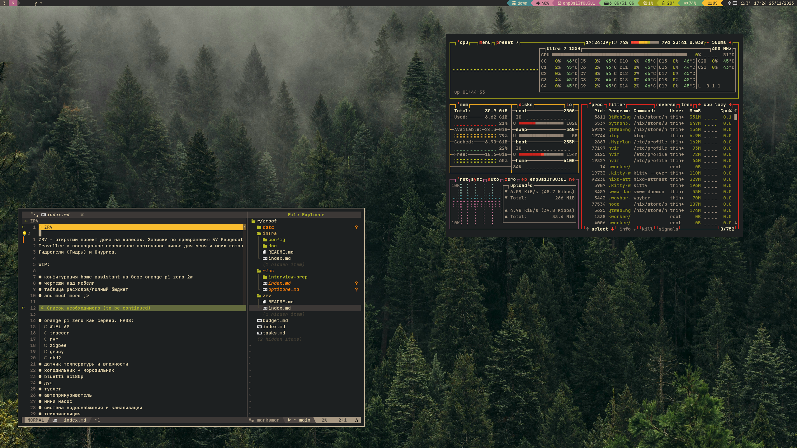
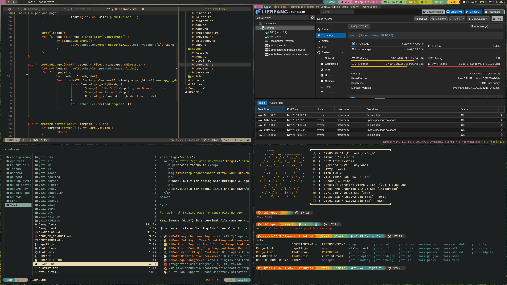

# ZROOT INFRA

Personal infrastructure config and Hyrpand rice.

Content:

- [Hyrland rice](#gruv-rice-box)
- [Infrastructure](#infrastructure)

## Gruv-Rice-Box



> [!WARNING] Images are out of date.

Workflow is based around these programs:

- Hyprland (Wayland)
- fish
- kitty
- nvim
- qutebrowser
- yazi

### Quick start

`flake.nix` contains all of the avaliable systems. You can add your own (and
delete mine) or you can use `generic-pc` or `generic-laptop`.

```Bash
# It is recommended to start at $HOME directory, because some components (only nh
# CLI at this moment) assume that $HOME/nixos is your system flake.
cd ~

# Obtain the source code (--recurse-submodules for wallpappers)
git clone --recurse-submodules https://github.com/optizone/nixos.git && cd nixos

# Set git credentials with your own
sed -i 's/gitUsername = "optizone"/gitUsername = "git-username"/' flake.nix
sed -i 's/gitEmail = "ilya.kek.lol.orbidol@gmail.com"/gitEmail = "email@email.com"/' flake.nix

# Set host and username (substitute `generic-pc -> generic-laptop` and 
# `pc-user -> laptop-user` in case of using `generic-laptop` system)
sed -i 's/host = "generic-pc"/host = "host"/' flake.nix
sed -i 's/username = "pc-user"/username = "username"/' flake.nix

# Copy your hardware config
# Assuming you are using clean NixOS install. In case not check paths.
cp /etc/nixos/hardware-configuration.nix ./hosts/generic/hardware-configuration.nix

# Apply to boot configuration your choosen system (generic-pc in this case)
# Assumes enabled experimental features. If not, add these argumets:
# `--extra-experimental-features nix-command --extra-experimental-features flakes`
nixos-rebuild boot --use-remote-sudo --flake ./#generic-pc

# Assign password for the user
sudo passwd username

# Pray 😈
reboot

# From now on you can use nh command to manage your system
nh --help
```

> [!NOTE]: There is a module at `home/flavours/standalone` for generic linux
> installation, but it isn't tested so you can try to figure that one out if you
> want to (PR's are welcomed).

### Configuration

Each module contains `default.nix` file that is used in `generic-*` systems. If
you want to select what software to install (for example you only need `firefox`
browser and don't want to install `google-chrome`) you can replace `../../home/`
line in `user.nix` with the list of modules you want to enable (for example
`../../home/browsers/firefox.nix` to install `firefox`). See
[home/default.nix](./home/default.nix) for default configuration.

### Gallery




## Infrastructure

> [!WARNING]
> This section (as also this very git repo) is under heavy development. Use
> wisely, don't run commands that you don't understand or haven't read.

All servers are using impermanence (`/` gets wiped at every boot) and sops to
manage secrets. This combo creates some challenges in provisioning systems on
new servers and also in configuring new, so be causious on what you really need
to persist and don't forget to do so.

### Quick start

How to provision config to remote host. Tested on RaspberryPi 5 running custom
installer image. You can build one yourself fillowing instructions at
<https://github.com/nvmd/nixos-raspberrypi>.

This is how to setup `rpi5-k` host.

```Bash
# On remote host:
# Print remote host age
cat /etc/ssh/ssh_host_ed25519_key.pub | nix run nixpkgs#ssh-to-age

# On local machine:
# Add age key to .sops.yaml 
nvim .sops.yaml

# Update secrets.yaml with new host key
nix run nixpkgs#sops updatekeys secrets.yaml

nix run github:nix-community/nixos-anywhere -- --build-on remote \
    --flake ./#rpi5-k \
    --target-host root@rpi5-k \
    # This will create `hardware-configuration.nix` module. In this particular
    # example it is already created, but for new hosts you won't have one.
    # So don't forget to import it.
    --generate-hardware-config nixos-generate-config \
        ./hosts/rpi5-k/hardware-configuration.nix \
    --copy-host-keys \
    # Omit default `restart` phase so we can move host keys to persistent storage
    --phases kexec,disko,install

# On remote host:
# Copy ssh keys to persistent location 
cp /etc/ssh/ssh_host_ed25519_key* /mnt/persist/etc/ssh

# At this point configuration is done
reboot

# On local host:
# Now you can provision the system using --target-host option
nixos-rebuild switch \
    --use-remote-sudo \
    --ask-sudo-password \
    --flake ./#rpi5-k \
    --target-host rpi5-k@rpi5-k \
    --build-host rpi5-k@rpi5-k
```

## Special thanks

To @Frost-Phoenix for inspiration (and configs).\
To @grahamc for his post
["Erase your darlings"](https://grahamc.com/blog/erase-your-darlings/).
